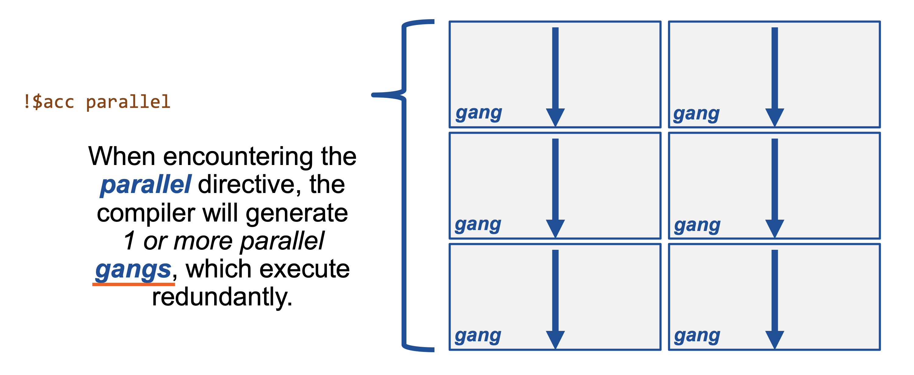
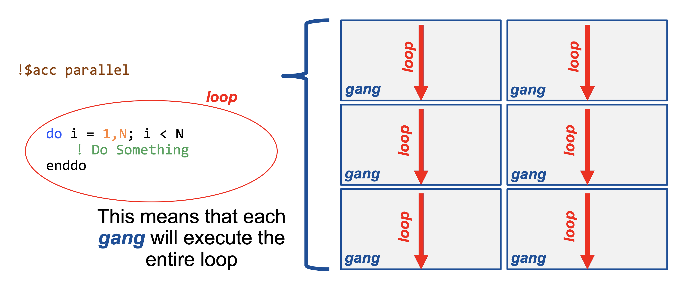
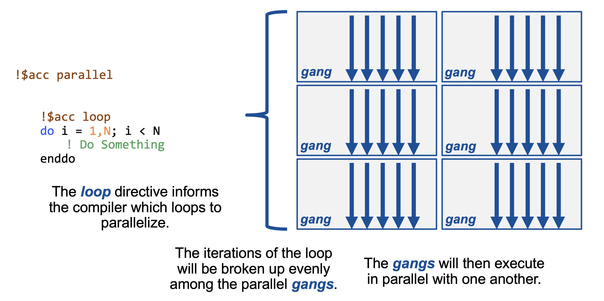

# Getting Started with OpenACC

In this lab you will learn the basics of using OpenACC to parallelize a simple application to run on multicore CPUs and GPUs. This lab is intended for Fortran programmers. If you prefer to use C/C++, click [this link.](../C/README.md)

---
Let's execute the cell below to display information about the GPUs running on the server by running the `pgaccelinfo` command, which ships with the PGI compiler that we will be using. To do this, execute the cell block below by giving it focus (clicking on it with your mouse), and hitting Ctrl-Enter, or pressing the play button in the toolbar above.  If all goes well, you should see some output returned below the grey cell.


```bash
$ pgaccelinfo
```

The output of the above command will vary according to which GPUs you have in your system. For example, if you are running the lab on a machine with NVIDIA Tesla K80 GPUs, you might would see the following:

```
CUDA Driver Version:           10020
NVRM version:                  NVIDIA UNIX x86_64 Kernel Module  440.64.00  Wed Apr 1 16:01:39 EDT 2020

Device Number:                 0
Device Name:                   TITAN Xp
Device Revision Number:        6.1
Global Memory Size:            12785221632
Number of Multiprocessors:     30
Concurrent Copy and Execution: Yes
Total Constant Memory:         65536
Total Shared Memory per Block: 49152
Registers per Block:           65536
Warp Size:                     32
Maximum Threads per Block:     1024
Maximum Block Dimensions:      1024, 1024, 64
Maximum Grid Dimensions:       2147483647 x 65535 x 65535
Maximum Memory Pitch:          2147483647B
Texture Alignment:             512B
Clock Rate:                    1582 MHz
Execution Timeout:             Yes
Integrated Device:             No
Can Map Host Memory:           Yes
Compute Mode:                  default
Concurrent Kernels:            Yes
ECC Enabled:                   No
Memory Clock Rate:             5705 MHz
Memory Bus Width:              384 bits
L2 Cache Size:                 3145728 bytes
Max Threads Per SMP:           2048
Async Engines:                 2
Unified Addressing:            Yes
Managed Memory:                Yes
Concurrent Managed Memory:     Yes
Preemption Supported:          Yes
Cooperative Launch:            Yes
Multi-Device:                  Yes
PGI Compiler Option:           -ta=tesla:cc60
```

This gives us lots of details about the GPU, for instance the device number, the type of device, and at the very bottom the command line argument we should use when targeting this GPU (see *_PGI Default Target_*). We will use this command line option a bit later to build for our GPU.

---
## Introduction

Our goal for this lab is to learn the first steps in accelerating an application with OpenACC. We advocate the following 3-step development cycle for OpenACC.
  


**Analyze** your code to determine most likely places needing parallelization or optimization.

**Parallelize** your code by starting with the most time consuming parts and check for correctness.

**Optimize** your code to improve observed speed-up from parallelization.

One should generally start the process at the top with the **analyze** step. For complex applications, it's useful to have a profiling tool available to learn where your application is spending its execution time and to focus your efforts there. The PGI compiler ships with a profiler called PGProf. Since our example code is quite a bit simpler than a full application, we'll skip profiling the code and simply analyze the code by reading it. 

---

## Analyze the Code

In the section below you will learn about the algorithm implemented in the example code and see examples pulled out of the source code. If you want a sneak peek at the source code, you can take a look at the files linked below.

[jacobi.f90](jacobi.f90)  
[laplace2d.f90](laplace2d.f90)  

### Code Description

The code simulates heat distribution across a 2-dimensional metal plate. In the beginning, the plate will be unheated, meaning that the entire plate will be room temperature. A constant heat will be applied to the edge of the plate and the code will simulate that heat distributing across the plate over time.  

This is a visual representation of the plate before the simulation starts:  
  
  
  
We can see that the plate is uniformly room temperature, except for the top edge. Within the [laplace2d.f90](laplace2d.f90) file, we see a function called **`initialize`**. This function is what "heats" the top edge of the plate. 
  
```fortran
    subroutine initialize(A, Anew, m, n)
      integer, parameter :: fp_kind=kind(1.0d0)
      real(fp_kind),allocatable,intent(out)   :: A(:,:)
      real(fp_kind),allocatable,intent(out)   :: Anew(:,:)
	  integer,intent(in)          :: m, n

      allocate ( A(0:n-1,0:m-1), Anew(0:n-1,0:m-1) )

      A    = 0.0_fp_kind
      Anew = 0.0_fp_kind

      A(0,:)    = 1.0_fp_kind
      Anew(0,:) = 1.0_fp_kind
    end subroutine initialize
```

After the top edge is heated, the code will simulate the heat distributing across the length of the plate. We will keep the top edge at a constant heat as the simulation progresses.

This is the plate after several iterations of our simulation:  
  
 

That's the theory: simple heat distribution. However, we are more interested in how the code works. 

### Code Breakdown

The 2-dimensional plate is represented by a 2-dimensional array containing double-precision floating point values. These doubles represent temperature; 0.0 is room temperature, and 1.0 is our max temperature. The 2-dimensional plate has two states, one represents the current temperature, and one represents the expected temperature values at the next step in our simulation. These two states are represented by arrays **`A`** and **`Anew`** respectively. The following is a visual representation of these arrays, with the top edge "heated".

  
    
Simulating this state in two arrays is very important for our **`calcNext`** function. Our calcNext is essentially our "simulate" function. calcNext will look at the inner elements of A (meaning everything except for the edges of the plate) and update each elements temperature based on the temperature of its neighbors.  If we attempted to calculate in-place (using only **`A`**), then each element would calculate its new temperature based on the updated temperature of previous elements. This data dependency not only prevents parallelizing the code, but would also result in incorrect results when run in serial. By calculating into the temporary array **`Anew`** we ensure that an entire step of our simulation has completed before updating the **`A`** array.

  

This is the **`calcNext`** function:

```fortran
01 function calcNext(A, Anew, m, n)
02   integer, parameter          :: fp_kind=kind(1.0d0)
03   real(fp_kind),intent(inout) :: A(0:n-1,0:m-1)
04   real(fp_kind),intent(inout) :: Anew(0:n-1,0:m-1)
05   integer,intent(in)          :: m, n
06   integer                     :: i, j
07   real(fp_kind)               :: error
08	  
09   error=0.0_fp_kind
10	  
11   do j=1,m-2
12     do i=1,n-2
13        Anew(i,j) = 0.25_fp_kind * ( A(i+1,j  ) + A(i-1,j  ) + &
14                                     A(i  ,j-1) + A(i  ,j+1) )
15        error = max( error, abs(Anew(i,j)-A(i,j)) )
16     end do
17   end do
18   calcNext = error
19 end function calcNext
```

We see on lines 13 and 14 where we are calculating the value of **`Anew`** at **`i,j`** by averaging the current values of its neighbors. Line 15 is where we calculate the current rate of change for the simulation by looking at how much the **`i,j`** element changed during this step and finding the maximum value for this **`error`**. This allows us to short-circuit our simulation if it reaches a steady state before we've completed our maximum number of iterations.

Lastly, our **`swap`** subroutine will copy the contents of **`Anew`** to **`A`**.

```fortran
01 subroutine swap(A, Anew, m, n)
02   integer, parameter        :: fp_kind=kind(1.0d0)
03   real(fp_kind),intent(out) :: A(0:n-1,0:m-1)
04   real(fp_kind),intent(in)  :: Anew(0:n-1,0:m-1)
05   integer,intent(in)        :: m, n
06   integer                   :: i, j
07 
08   do j=1,m-2
09     do i=1,n-2
10       A(i,j) = Anew(i,j)
11     end do
12   end do
13 end subroutine swap
```

---

## Run the Code 

Now that we've seen what the code does, let's build and run it. We need to record the results of our program before making any changes so that we can compare them to the results from the parallel code later on. It is also important to record the time that the program takes to run, as this will be our primary indicator to whether or not our parallelization is improving performance.

### Compiling the Code with PGI

For this lab we are using the PGI compiler to compiler our code. You will not need to memorize the compiler commands to complete this lab, however, they will be helpful to know if you want to parallelize your own personal code with OpenACC.

**pgcc**      : this is the command to compile C code  
**pgc++**     : this is the command to compile C++ code  
**pgfortran** : this is the command to compile Fortran code  
**-fast**     : this compiler flag instructs the compiler to use what it believes are the best possible optimizations for our system


```bash
$ pgfortran -fast -o laplace laplace2d.f90 jacobi.f90 && echo "Compilation Successful!" && ./laplace
```

### Expected Output
```
laplace2d.f90:
jacobi.f90:
Compilation Successful!
Jacobi relaxation Calculation: 4096 x 4096 mesh
    0  0.250000
  100  0.002397
  200  0.001204
  300  0.000804
  400  0.000603
  500  0.000483
  600  0.000403
  700  0.000345
  800  0.000302
  900  0.000269
 completed in     58.397 seconds
```
### Understanding Code Results

We see from the output that onces every hundred steps the program outputs the value of `error`, which is the maximum rate of change among the cells in our array. If these outputs change during any point while we parallelize our code, we know we've made a mistake. For simplicity, focus on the last output, which occurred at iteration 900 (the error value is 0.000269). It is also helpful to record the time the program took to run (it should have been about a minute). Our goal while parallelizing the code is ultimately to make it faster, so we need to know our "base runtime" in order to know if the code is running faster. Keep in mind that if you run the code multiple times you may get slightly different total runtimes, but you should get the same values for the error rates.

## Parallelizing Loops with OpenACC

At this point we know that most of the work done in our code happens in the `calcNext` and `swap` routines, so we'll focus our efforts there. We want the compiler to parallelize the loops in those two routines because that will give up the maximum speed-up over the baseline we just measured. To do this, we're going to use the OpenACC `parallel loop` directive.

---

## OpenACC Directives

Using OpenACC directives will allow us to parallelize our code without needing to explicitly alter our code. What this means is that, by using OpenACC directives, we can have a single code that will function as both a sequential code and a parallel code.

### OpenACC Syntax

**`!$acc <directive> <clauses>`**

`!$acc` in Fortran is what's known as a "compiler hint" or "compiler directive." These are very similar to programmer comments, since the line begins with a comment statement `!`. After the comment is `$acc`. OpenACC compliant compilers with appropriate command line options can interpret this as an OpenACC directive that "guide" the compiler above and beyond what the programming language allows. If the compiler does not understand `!$acc` it can ignore it, rather than throw a syntax error because it's just a comment.

**directives** are commands in OpenACC that will tell the compiler to do some action. For now, we will only use directives that allow the compiler to parallelize our code.

**clauses** are additions/alterations to our directives. These include (but are not limited to) optimizations. The way that I prefer to think about it: directives describe a general action for our compiler to do (such as, paralellize our code), and clauses allow the programmer to be more specific (such as, how we specifically want the code to be parallelized).


---
### Parallel and Loop Directives

There are three directives we will cover in this lab: `parallel`, `loop`, and `parallel loop`. Once we understand all three of them, you will be tasked with parallelizing our laplace code with your preferred directive (or use all of them, if you'd like!)

The parallel directive may be the most straight-forward of the directives. It will mark a region of the code for parallelization (this usually only includes parallelizing a single **for** loop.) Let's take a look:

```fortran
    !$acc parallel loop
    do i=1,N
        < loop code >
    enddo
```

We may also define a *parallel region*. The parallel region may have multiple loops (though this is often not recommended!) The parallel region is everything contained within the outer-most curly braces.

```fortran
!$acc parallel
    !$acc loop
    do i=1,N
        < loop code >
    enddo
!$acc end parallel
```

`!$acc parallel loop` will mark the next loop for parallelization. It is extremely important to include the `loop`, otherwise you will not be parallelizing the loop properly. The parallel directive tells the compiler to "redundantly parallelize" the code. The `loop` directive specifically tells the compiler that we want the loop parallelized. Let's look at an example of why the loop directive is so important. The `parallel` directive tells the compiler to create somewhere to run parallel code. OpenACC calls that somewhere a `gang`, which might be a thread on the CPU or maying a CUDA threadblock or OpenCL workgroup. It will choose how many gangs to create based on where you're running, only a few on a CPU (like 1 per CPU core) or lots on a GPU (1000's possibly). Gangs allow OpenACC code to scale from small CPUs to large GPUs because each one works completely independently of each other gang. That's why there's a space between gangs in the images below.



---



There's a good chance that I don't want my loop to be run redundantly in every gang though, that seems wasteful and potentially dangerous. Instead I want to instruct the compiler to break up the iterations of my loop and to run them in parallel on the gangs. To do that, I simply add a `loop` directive to the interesting loops. This instructs the compiler that I want my loop to be parallelized and promises to the compiler that it's safe to do so. Now that I have both `parallel` and `loop`, things loop a lot better (and run a lot faster). Now the compiler is spreading my loop iterations to all of my gangs, but also running multiple iterations of the loop at the same time within each gang as a *vector*. Think of a vector like this, I have 10 numbers that I want to add to 10 other numbers (in pairs). Rather than looking up each pair of numbers, adding them together, storing the result, and then moving on to the next pair in-order, modern computer hardware allows me to add all 10 pairs together all at once, which is a lot more efficient.



The `acc parallel loop` directive is both a promise and a request to the compiler. I as the programmer am promising that the loop can safely be parallelized and am requesting that the compiler do so in a way that makes sense for the machine I am targeting. The compiler may make completely different decisions if I'm compiling for a multicore CPU than it would for a GPU and that's the idea. OpenACC enables programmers to parallelize their codes without having to worry about the details of how best to do so for every possible machine. 

### The Reduction Clause

There's one very important clause that you'll need to know for our example code: the `reduction` clause. Take note of how the loops in `calcNext` each calculate an error value and then compare against the maximum value to find an absolute maximum. When executing this operation in parallel, it's necessary to do a *reduction* in order to ensure you always get the correct answer. A reduction takes all of the values of `error` calculated in the loops and *reduces* them down to a single answer, in this case the maximum. There are a variety of reductions that can be done, but for our example code we only care about the max operation. We will inform the compiler about our reduction by adding a `reduction(max:error)` clause to the `acc parallel loop` in the `calcNext` function.

### Parallelize the Example Code

At this point you have all of the tools you need to begin accelerating your application. The loops you will be parallelizing are in [laplace2d.f90](laplace2d.f90). You can edit the file directly from your browser window, but be sure to save your changes before moving on to the next step. It is advisible to start with the `calcNext` routine and test your changes by compiling and running the code before moving on to the `swap` routine. OpenACC can be incrementally added to your application so that you can ensure each change is correct before getting too far along, which greatly simplifies debugging.

Once you have made your changes, you can compile and run the application by running the cell below. Please note that our compiler options have changed a little bit, we've added the following two important flags:

* `-ta=multicore` - This instructs the compiler to build your OpenACC loops and to target them to run across the cores of a multicore CPU. 
* `-Minfo=accel` - This instructs the compiler to give us some additional information about how it parallelized the code. We'll review how to interpret this feedback in just a moment.

Go ahead and build and run the code, noting both the error value at the 900th iteration and the total runtime. If the error value changed, you may have made a mistake. Don't forget the `reduction(max:error)` clause on the loop in the `calcNext` function!


```bash
$ pgfortran -fast -ta=multicore -Minfo=accel -o laplace laplace2d.f90 jacobi.f90 && echo "Compilation Successful!" && ./laplace
```

Here's the ouput you should see after running the above cell. Your total runtime may be slightly different, but it should be close. If you find yourself stuck on this part, you can take a look at [our solution](solutions/laplace2d.parallel.f90). 

```
laplace2d.f90:
calcnext:
     58, Generating Multicore code
         59, !$acc loop gang
     58, Generating reduction(max:error)
     60, Loop is parallelizable
swap:
     76, Generating Multicore code
         77, !$acc loop gang
     78, Loop is parallelizable
jacobi.f90:
Compilation Successful!
Jacobi relaxation Calculation: 4096 x 4096 mesh
    0  0.250000
  100  0.002397
  200  0.001204
  300  0.000804
  400  0.000603
  500  0.000483
  600  0.000403
  700  0.000345
  800  0.000302
  900  0.000269
 completed in     30.291 seconds
```

Great! Now our code is running nearly twice as fast by using all of the cores on our CPU, but I really want to run the code on a GPU. Once you have accelerated both loop nests in the example application and are sure you're getting correct results, you only need to change one compiler option to build the code for the GPUs on our node.

Here's the new compiler option we'll be using:
* `-ta=tesla:managed` - Build the code for the NVIDIA Tesla GPU on our system, using managed memory 

Notice above that I'm using something called *managed memory* for this task. Since our CPU and GPU each have their own physical memory I need to move the data between these memories. To simplify things this week, I'm telling the compiler to manage all of that data movement for me. Next week you'll learn how and why to manage the data movement yourself.


```bash
$ pgfortran -fast -ta=tesla:managed -Minfo=accel -o laplace  laplace2d.f90 jacobi.f90 && echo "Compilation Successful!" && ./laplace
```

Wow! That ran a lot faster! This demonstrates the power of using OpenACC to accelerate an application. I made very minimal code changes and could run my code on multicore CPUs and GPUs by only changing my compiler option. Very cool!

Just for your reference, here's the timings I saw at each step of the process. Please keep in mind that your times may be just a little bit different

| Version   | Time (s) |
|-----------|----------|
| Original  | 58       |
| Multicore | 30       |
| GPU       | 1.5      |

So how did the compiler perform this miracle of speeding up my code on both the CPU and GPU? Let's compiler the compiler output from those two versions:

#### CPU
```
calcnext:
     58, Generating Multicore code
         59, !$acc loop gang
     58, Generating reduction(max:error)
     60, Loop is parallelizable
```
#### GPU
```
calcnext:
     58, Accelerator kernel generated
         Generating Tesla code
         58, Generating reduction(max:error)
         59, !$acc loop gang ! blockidx%x
         60, !$acc loop vector(128) ! threadidx%x
     58, Generating implicit copyin(a(:n-1,:m-1)) [if not already present]
         Generating implicit copy(error) [if not already present]
         Generating implicit copyout(anew(1:n-2,1:m-2)) [if not already present]
     60, Loop is parallelizable
```

Notice the differences on lines 59 and 60  . The compiler recognized that the loops could be parallelized, but chose to break up the work in different ways. In a future lab you will learn more about how OpenACC breaks up the work, but for now it's enough to know that the compiler understood the differences between these two processors and changed its plan to make sense for each.

## Conclusion

That's it, you now have the necessary tools to start using OpenACC in your application! In future labs you will learn about how to manage the CPU and GPU memories and how to optimize your loops to run faster, so be sure to attend each week of this online course and to do each lab.

## Bonus Task

It just so happens that the `!$acc parallel loop` directive isn't the only way we could have parallelized our code with OpenACC, it's just the easiest to understand. As a bonus task, [click here](Lab1_Kernels_Fortran.md) to learn about the `!$acc kernels` directive and how it differs from the approach we've already taken.

---

## Post-Lab Summary

If you would like to download this lab for later viewing, you can execute the following cell block to create a zip-file of the files you've been working on, and download it with the link below.


```bash
%%bash
rm -f openacc_files.zip *.o laplace
zip -r openacc_files.zip *
```

