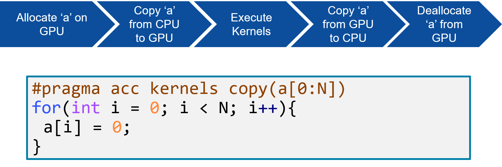
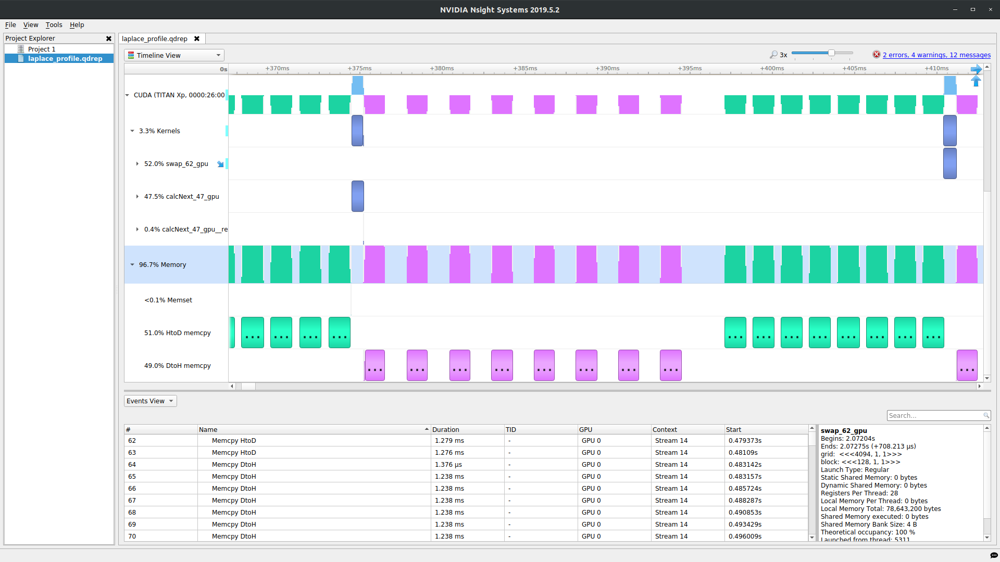
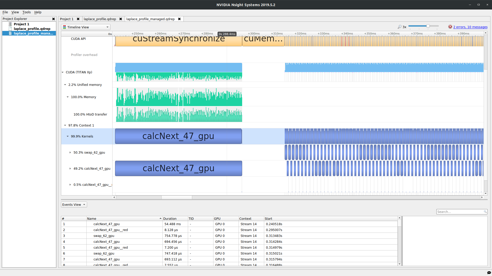
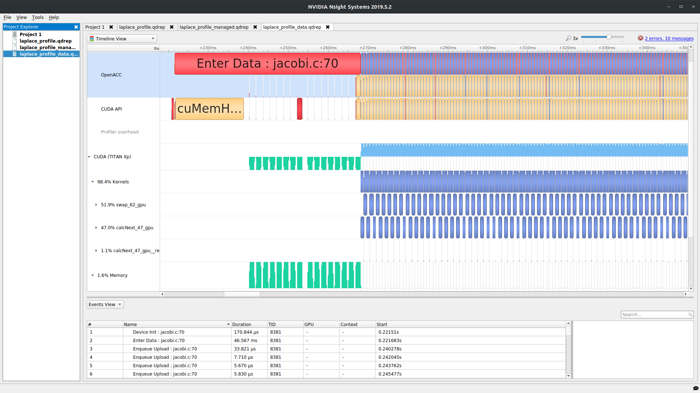

# Data Management with OpenACC

This version of the lab is intended for C/C++ programmers. The Fortran version of this lab is available [here](../Fortran/README.md).

---
To get started on Summit, we have to set up our environment by loading the modules we will need:

```bash
$ module load cuda
$ module load pgi
```

Next, let's create an alias we can use to launch jobs on summit. We need to use the `bsub` command to request a node and the `jsrun` command to launch our jobs on the nodes that we are given.

```bash
$ alias lsfrun='bsub -W 5 -nnodes 1 -P <allocation_ID> -Is jsrun -n1 -a1 -c10 -g1'
```

---
Let's execute the cell below to display information about the GPUs running on the server. To do this, execute the cell block below by giving it focus (clicking on it with your mouse), and hitting Ctrl-Enter, or pressing the play button in the toolbar above.  If all goes well, you should see some output returned below the grey cell.


```bash
$ pgaccelinfo
```

---

## Introduction

Our goal for this lab is to use the OpenACC Data Directives to properly manage our data.
  


This is the OpenACC 3-Step development cycle.

**Analyze** your code, and predict where potential parallelism can be uncovered. Use profiler to help understand what is happening in the code, and where parallelism may exist.

**Parallelize** your code, starting with the most time consuming parts. Focus on maintaining correct results from your program.

**Optimize** your code, focusing on maximizing performance. Performance may not increase all-at-once during early parallelization.

We are currently tackling the **parallelize** and **optimize** steps by adding the *data clauses* necessary to parallelize the code without CUDA Managed Memory and then *structured data directives* to optimize the data movement of our code.

---

## Run the Code (With Managed Memory)

In the [previous lab](../../../lab1/English/C/README.md), we added OpenACC loop directives and relied on a feature called CUDA Managed Memory to deal with the separate CPU & GPU memories for us. Just adding OpenACC to our two loop nests we achieved a considerable performance boost. However, managed memory is not compatible with all GPUs or all compilers and it sometimes performs worse than programmer-defined memory management. Let's start with our solution from the previous lab and use this as our performance baseline. Note the runtime from the follow cell.


```bash
$ pgcc -fast -ta=tesla:managed -Minfo=accel -o laplace_managed jacobi.c laplace2d.c && ./laplace_managed
```

### Optional: Analyze the Code

If you would like a refresher on the code files that we are working on, you may view both of them using the two links below.

[jacobi.c](jacobi.c)  
[laplace2d.c](laplace2d.c)  

## Building Without Managed Memory

Since we ultimately don't want to use CUDA Managed Memory, because it's less portable and often less performant than moving the data explicitly,, let's removed the managed option from our compiler options. Try building and running the code now. What happens?


```bash
$ pgcc -fast -ta=tesla -Minfo=accel -o laplace jacobi.c laplace2d.c && ./laplace
```

Uh-oh, this time our code failed to build. Let's take a look at the compiler output to understand why:

```
jacobi.c:
laplace2d.c:
PGC-S-0155-Compiler failed to translate accelerator region (see -Minfo messages): Could not find allocated-variable index for symbol - A (laplace2d.c: 47)
calcNext:
     47, Generating Tesla code
         48, #pragma acc loop gang /* blockIdx.x */
             Generating reduction(max:error)         50, #pragma acc loop vector(128) /* threadIdx.x */
     48, Accelerator restriction: size of the GPU copy of Anew,A is unknown
     50, Loop is parallelizable
PGC-F-0704-Compilation aborted due to previous errors. (laplace2d.c)
PGC/x86-64 Linux 19.10-0: compilation aborted
```

This error message is not very intuitive, so let me explain it to you.:

* `PGC-S-0155-Compiler failed to translate accelerator region (see -Minfo messages): Could not find allocated-variable index for symbol (laplace2d.c: 47)` - The compiler doesn't like something about a variable from line 47 of our code.
* `48, Accelerator restriction: size of the GPU copy of Anew,A is unknown` - I don't see any further information about line 47, but at line 48 the compiler is struggling to understand the size and shape of the arrays Anew and A. It turns out, this is our problem.

So, what these cryptic compiler errors are telling us is that the compiler needs to create copies of A and Anew on the GPU in order to run our code there, but it doesn't know how big they are, so it's giving up. We'll need to give the compiler more information about these arrays before it can move forward, so let's find out how to do that.

## OpenACC Data Clauses

Data clauses allow the programmer to specify data transfers between the host and device (or in our case, the CPU and the GPU). Because they are clauses, they can be added to other directives, such as the `parallel loop` directive that we used in the previous lab. Let's look at an example where we do not use a data clause.

```cpp
int *A = (int*) malloc(N * sizeof(int));

#pragma acc parallel loop
for( int i = 0; i < N; i++ )
{
    A[i] = 0;
}
```

We have allocated an array `A` outside of our parallel region. This means that `A` is allocated in the CPU memory. However, we access `A` inside of our loop, and that loop is contained within a *parallel region*. Within that parallel region, `A[i]` is attempting to access a memory location within the GPU memory. We didn't explicitly allocate `A` on the GPU, so one of two things will happen.

1. The compiler will understand what we are trying to do, and automatically copy `A` from the CPU to the GPU.
2. The program will check for an array `A` in GPU memory, it won't find it, and it will throw an error.

Instead of hoping that we have a compiler that can figure this out, we could instead use a *data clause*.

```cpp
int *A = (int*) malloc(N * sizeof(int));

#pragma acc parallel loop copy(A[0:N])
for( int i = 0; i < N; i++ )
{
    A[i] = 0;
}
```

We will learn the `copy` data clause first, because it is the easiest to use. With the inclusion of the `copy` data clause, our program will now copy the content of `A` from the CPU memory, into GPU memory. Then, during the execution of the loop, it will properly access `A` from the GPU memory. After the parallel region is finished, our program will copy `A` from the GPU memory back to the CPU memory. Let's look at one more direct example.

```cpp
int *A = (int*) malloc(N * sizeof(int));

for( int i = 0; i < N; i++ )
{
    A[i] = 0;
}

#pragma acc parallel loop copy(A[0:N])
for( int i = 0; i < N; i++ )
{
    A[i] = 1;
}
```

Now we have two loops; the first loop will execute on the CPU (since it does not have an OpenACC parallel directive), and the second loop will execute on the GPU. Array `A` will be allocated on the CPU, and then the first loop will execute. This loop will set the contents of `A` to be all 0. Then the second loop is encountered; the program will copy the array `A` (which is full of 0's) into GPU memory. Then, we will execute the second loop on the GPU. This will edit the GPU's copy of `A` to be full of 1's.

At this point, we have two seperate copies of `A`. The CPU copy is full of 0's, and the GPU copy is full of 1's. Now, after the parallel region finishes, the program will copy `A` back from the GPU to the CPU. After this copy, both the CPU and the GPU will contain a copy of `A` that contains all 1's. The GPU copy of `A` will then be deallocated.

This image offers another step-by-step example of using the copy clause.



We are also able to copy multiple arrays at once by using the following syntax.

```cpp
#pragma acc parallel loop copy(A[0:N], B[0:N])
for( int i = 0; i < N; i++ )
{
    A[i] = B[i];
}
```

Of course, we might not want to copy our data both to and from the GPU memory. Maybe we only need the array's values as inputs to the GPU region, or maybe it's only the final results we care about, or perhaps the array is only used temporarily on the GPU and we don't want to copy it either directive. The following OpenACC data clauses provide a bit more control than just the `copy` clause.

* `copyin` - Create space for the array and copy the input values of the array to the device. At the end of the region, the array is deleted without copying anything back to the host.
* `copyout` - Create space for the array on the device, but don't initialize it to anything. At the end of the region, copy the results back and then delete the device array.
* `create` - Create space of the array on the device, but do not copy anything to the device at the beginning of the region, nor back to the host at the end. The array will be deleted from the device at the end of the region.
* `present` - Don't do anything with these variables. I've put them on the device somewhere else, so just assume they're available.

You may also use them to operate on multiple arrays at once, by including those arrays as a comma separated list.

```cpp
#pragma acc parallel loop copy( A[0:N], B[0:M], C[0:Q] )
```

You may also use more than one data clause at a time.

```cpp
#pragma acc parallel loop create( A[0:N] ) copyin( B[0:M] ) copyout( C[0:Q] )
```


### Array Shaping

The shape of the array specifies how much data needs to be transferred. Let's look at an example:

```cpp
#pragma acc parallel loop copy(A[0:N])
for( int i = 0; i < N; i++ )
{
    A[i] = 0;
}
```

Focusing specifically on the `copy(A[0:N])`, the shape of the array is defined within the brackets. The syntax for array shape is `[starting_index:size]`. This means that (in the code example) we are copying data from array `A`, starting at index 0 (the start of the array), and copying N elements (which is most likely the length of the entire array).

We are also able to only copy a portion of the array:

```cpp
#pragma acc parallel loop copy(A[1:N-2])
```

This would copy all of the elements of `A` except for the first, and last element.

Lastly, if you do not specify a starting index, 0 is assumed. This means that

```cpp
#pragma acc parallel loop copy(A[0:N])
```

is equivalent to

```cpp
#pragma acc parallel loop copy(A[:N])
```

## Making the Sample Code Work without Managed Memory

In order to build our example code without CUDA managed memory we need to give the compiler more information about the arrays. How do our two loop nests use the arrays `A` and `Anew`? The `calcNext` function take `A` as input and generates `Anew` as output, but also needs Anew copied in because we need to maintain that *hot* boundary at the top. So you will want to add a `copyin` clause for `A` and a `copy` clause for `Anew` on your region. The `swap` function takes `Anew` as input and `A` as output, so it needs the exact opposite data clauses. It's also necessary to tell the compiler the size of the two arrays by using array shaping. Our arrays are `m` times `n` in size, so we'll tell the compiler their shape starts at `0` and has `n*m` elements, using the syntax above. Go ahead and add data clauses to the two `parallel loop` directives in [laplace2d.c](laplace2d.c). Then try to build again.


```bash
$ pgcc -fast -ta=tesla -Minfo=accel -o laplace jacobi.c laplace2d.c && ./laplace
```

Well, the good news is that it should have built correctly and run. If it didn't, check your data clauses carefully. The bad news is that now it runs a whole lot slower than it did before. Let's try to figure out why. The PGI compiler provides your executable with built-in timers, so let's start by enabling them and seeing what it shows. You can enable these timers by setting the environment variable `PGI_ACC_TIME=1`. Run the cell below to get the program output with the built-in profiler enabled.


```bash
$ pgcc -fast -ta=tesla -Minfo=accel -o laplace jacobi.c laplace2d.c && PGI_ACC_TIME=1 ./laplace
```

Your output should look something like what you see below.
```
 total: 189.014216 s

Accelerator Kernel Timing data
/labs/lab2/English/C/laplace2d.c
  calcNext  NVIDIA  devicenum=0
    time(us): 53,290,779
    47: compute region reached 1000 times
        47: kernel launched 1000 times
            grid: [4094]  block: [128]
             device time(us): total=2,427,090 max=2,447 min=2,406 avg=2,427
            elapsed time(us): total=2,486,633 max=2,516 min=2,464 avg=2,486
        47: reduction kernel launched 1000 times
            grid: [1]  block: [256]
             device time(us): total=19,025 max=20 min=19 avg=19
            elapsed time(us): total=48,308 max=65 min=44 avg=48
    47: data region reached 4000 times
        47: data copyin transfers: 17000
             device time(us): total=33,878,622 max=2,146 min=6 avg=1,992
        57: data copyout transfers: 10000
             device time(us): total=16,966,042 max=2,137 min=9 avg=1,696
/labs/lab2/English/C/laplace2d.c
  swap  NVIDIA  devicenum=0
    time(us): 36,214,666
    62: compute region reached 1000 times
        62: kernel launched 1000 times
            grid: [4094]  block: [128]
             device time(us): total=2,316,826 max=2,331 min=2,305 avg=2,316
            elapsed time(us): total=2,378,419 max=2,426 min=2,366 avg=2,378
    62: data region reached 2000 times
        62: data copyin transfers: 8000
             device time(us): total=16,940,591 max=2,352 min=2,114 avg=2,117
        70: data copyout transfers: 9000
             device time(us): total=16,957,249 max=2,133 min=13 avg=1,884
```

 The total runtime was roughly 190 with the profiler turned on, but only about 130 seconds without. We can see that `calcNext` required roughly 53 seconds to run by looking at the `time(us)` line under the `calcNext` line.  We can also look at the `data region` section and determine that 34 seconds were spent copying data to the device and 17 seconds copying data out for the device. The `swap` function has very similar numbers. That means that the program is actually spending very little of its runtime doing calculations. Why is the program copying so much data around? The screenshot below comes from the Nsight Systems profiler and shows part of one step of our outer while loop. The greenish and pink colors are data movement and the blue colors are our kernels (calcNext and swap). Notice that for each kernel we have copies to the device (greenish) before and copies from the device (pink) after. The means we have 4 segments of data copies for every iteration of the outer while loop.
 

 
 Let's contrast this with the managed memory version. The image below shows the same program built with managed memory. Notice that there's a lot of "data migration" at the first kernel launch, where the data is first used, but there's no data movement between kernels after that. This tells me that the data movement isn't really needed between these kernels, but we need to tell the compiler that. 
 



Because the while loop and our kernels are in two separate files, the compiler can't really see that the data is reused on the GPU between those function. We need to move our data movement up to a higher level where we can reuse it for each step through the program. To do that, we'll add OpenACC data directives.

---

## OpenACC Structured Data Directive

The OpenACC data directives allow the programmer to explicitly manage the data on the device (in our case, the GPU). Specifically, the structured data directive will mark a static region of our code as a **data region**.

```cpp
< Initialize data on host (CPU) >

#pragma acc data < data clauses >
{

    < Code >

}
```

Device memory allocation happens at the beginning of the region, and device memory deallocation happens at the end of the region. Additionally, any data movement from the host to the device (CPU to GPU) happens at the beginning of the region, and any data movement from the device to the host (GPU to CPU) happens at the end of the region. Memory allocation/deallocation and data movement is defined by which clauses the programmer includes. This is a list of the most important data clauses that we can use:


### Encompassing Multiple Compute Regions

A single data region can contain any number of parallel/kernels regions. Take the following example:

```cpp
#pragma acc data copyin(A[0:N], B[0:N]) create(C[0:N])
{

    #pragma acc parallel loop
    for( int i = 0; i < N; i++ )
    {
        C[i] = A[i] + B[i];
    }
    
    #pragma acc parallel loop
    for( int i = 0; i < N; i++ )
    {
        A[i] = C[i] + B[i];
    }

}
```

You may also encompass function calls within the data region:

```cpp
void copy(int *A, int *B, int N)
{
    #pragma acc parallel loop
    for( int i = 0; i < N; i++ )
    {
        A[i] = B[i];
    }
}

...

#pragma acc data copyout(A[0:N],B[0:N]) copyin(C[0:N])
{
    copy(A, C, N);
    
    copy(A, B, N);
}
```

### Adding the Structured Data Directive to our Code

Use the following links to edit our laplace code. Add a structured data directive to properly handle the arrays `A` and `Anew`. We've already added data clauses to our two functions containing our GPU kernels, so this time we'll move up the calltree and add a structured data region around our while loop in the main program. Think about the input and output to this while loop and choose your data clauses for `A` and `Anew` accordingly.

[jacobi.c](jacobi.c)   

Then, run the following script to check you solution. You code should run just as good as (or slightly better) than our managed memory code.


```bash
$ pgcc -fast -ta=tesla -Minfo=accel -o laplace jacobi.c laplace2d.c && ./laplace
```

Did your runtime go down? It should have but the answer should still match the previous runs. Let's take a look at the profiler now.



Notice that we no longer see the greenish and pink bars on either side of each iteration, like we did before. Instead, we see a red OpenACC `Enter Data` region which contains some greenish bars corresponding to host-to-device data transfer preceding any GPU kernel launches. This is because our data movement is now handled by the outer data region, not the data clauses on each loop. Data clauses count how many times an array has been placed into device memory and only copies data the outermost time it encounters an array. This means that the data clauses we added to our two functions are now used only for shaping and no data movement will actually occur here anymore, thanks to our outer `data` region.

This reference counting behavior is really handy for code development and testing. Just like we just did, you can add clauses to each of your OpenACC `parallel loop` or `kernels` regions to get everything running on the accelerator and then just wrap those functions with a data region when you're done and the data movement magically disappears. Furthermore, if you want to isolate one of those functions into a standalone test case you can do so easily, because the data clause is already in the code. 

---

## OpenACC Update Directive

When we use the data clauses you are only able to copy data between host and device memory at the beginning and end of your regions, but what if you need to copy data in the middle? For example, what if we wanted to debug our code by printing out the array every 100 steps to make sure it looks right. In order to transfer data at those times, we can use the `update` directive. The update directive will explicitly transfer data between the host and the device. The `update` directive has two clauses:

* `self` - The self clause will transfer data from the device to the host (GPU to CPU). You will sometimes see this clause called the `host` clause.
* `device` - The device clause will transfer data from the host to the device (CPU to GPU).

The syntax would look like:

`#pragma acc update self(A[0:N])`

`#pragma acc update device(A[0:N])`

All of the array shaping rules apply.

As an example, let's create a version of our laplace code where we want to print the array `A` after every 100 iterations of our loop. The code will look like this:

```cpp
#pragma acc data copyin( A[:m*n],Anew[:m*n] )
{
    while ( error > tol && iter < iter_max )
    {
        error = calcNext(A, Anew, m, n);
        swap(A, Anew, m, n);
        
        if(iter % 100 == 0)
        {
            printf("%5d, %0.6f\n", iter, error);
            for( int i = 0; i < n; i++ )
            {
                for( int j = 0; j < m; j++ )
                {
                    printf("%0.2f ", A[i+j*m]);
                }
                printf("\n");
            }
        }
        
        iter++;

    }
}
```

Let's run this code (on a very small data set, so that we don't overload the console by printing thousands of numbers).


```bash
$ cd update && pgcc -fast -ta=tesla -Minfo=accel -o laplace_no_update jacobi.c laplace2d.c && ./laplace_no_update 10 10 && cd -
```

We can see that the array is not changing. This is because the host copy of `A` is not being *updated* between loop iterations. Let's add the update directive, and see how the output changes.

```cpp
#pragma acc data copyin( A[:m*n],Anew[:m*n] )
{
    while ( error > tol && iter < iter_max )
    {
        error = calcNext(A, Anew, m, n);
        swap(A, Anew, m, n);
        
        if(iter % 100 == 0)
        {
            printf("%5d, %0.6f\n", iter, error);
            
            #pragma acc update self(A[0:m*n])
            
            for( int i = 0; i < n; i++ )
            {
                for( int j = 0; j < m; j++ )
                {
                    printf("%0.2f ", A[i+j*m]);
                }
                printf("\n");
            }
        }
        
        iter++;

    }
}
```


```bash
$ cd update/solution && pgcc -fast -ta=tesla -Minfo=accel -o laplace_update jacobi.c laplace2d.c && ./laplace_update 10 10 && cd -
```

Although you weren't required to add an `update` directive to this example code, except in the contrived example above, it's an extremely important directive for real applications because it allows you to do I/O or communication necessary for your code to execute without having to pay the cost of allocating and decallocating arrays on the device each time you do so.

---

## Conclusion

Relying on managed memory to handle data management can reduce the effort the programmer needs to parallelize their code. However, not all GPUs work with managed memory. Explicit data management also guarantees that we achieve the best performance. In this lab you learned about how to use *data clauses* and *structured data directives* to explicitly manage device memory and remove your reliance on CUDA Managed Memory. 

---

## Bonus Task

If you would like some additional lessons on using OpenACC, there is an Introduction to OpenACC video series available from the OpenACC YouTube page. The fifth video in the series covers a lot of the content that was covered in this lab.  

[Introduction to Parallel Programming with OpenACC - Part 5](https://youtu.be/0zTX7-CPvV8)  

## Post-Lab Summary

You can execute the following cell block to create a zip-file of the files you've been working on.


```bash
%%bash
rm -f openacc_files.zip *.o laplace laplace_managed update/*.o update/solution/*.o update/laplace_no_update update/solution/laplace_update
zip -r openacc_files.zip *
```
